

  

<h1 align="center">MarkAura</h1>

  A role-based marketing agency management platform from campaign request, to execution, to delivery.

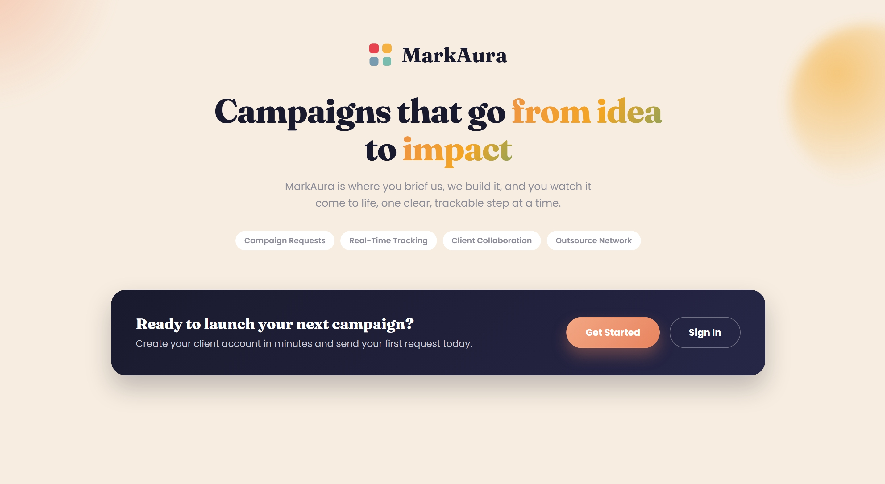

## Description

MarkAura is a marketing agency management platform that manages the full lifecycle of a campaign from a client's initial request, through planning and execution by agency staff, to coordination with outsourced partners. Instead of managing this back-and-forth over emails and spreadsheets, MarkAura gives each party (clients, agency staff, and outsource partners) a role-based view of exactly what they need to act on next: clients submit and track campaign requests, staff review requests and manage active campaigns, and outsource agencies handle delegated tasks, all through a single, status-driven workflow.

This repository contains the **React client** for MarkAura. The API is a separate Node/Express app; see [`marketing-agency-backend`](https://github.com/mo-durazi/marketing-agency-backend).

## Deployment

| Service | Platform | Link |
|---|---|---|
| Client (this repo) | [Vercel](https://vercel.com) | [marketing-agency-frontend-theta.vercel.app](https://marketing-agency-frontend-theta.vercel.app/) |
| API | [Render](https://render.com) | <!-- add the live Render URL here --> |
| Database | [MongoDB Atlas](https://www.mongodb.com/atlas) |  |

## User Stories

### Client
**Account & Profile**
- As a client, I want to register and sign in to the platform, so that I can access my company's campaign data securely.
- As a client, I want to view and update my company profile, so that my contact and industry information stays accurate.

   
  Registration form

  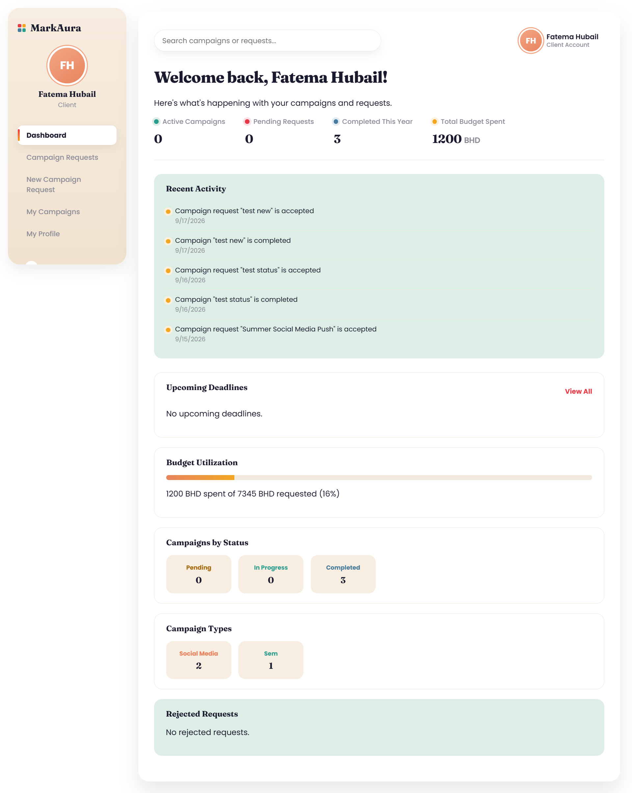 
  Client dashboard after signing in

   
  Company profile page

**Submitting Campaign Requests**
- As a client, I want to submit a new campaign request with my goals, budget, and preferred channels, so that the agency has everything it needs to start planning.
- As a client, I want to edit my request while it's still awaiting review, so that I can correct or refine details before staff starts working on it.
- As a client, I want to delete a request I submitted, so that I'm not committed to a campaign I no longer need if it hasn't been accepted yet.

  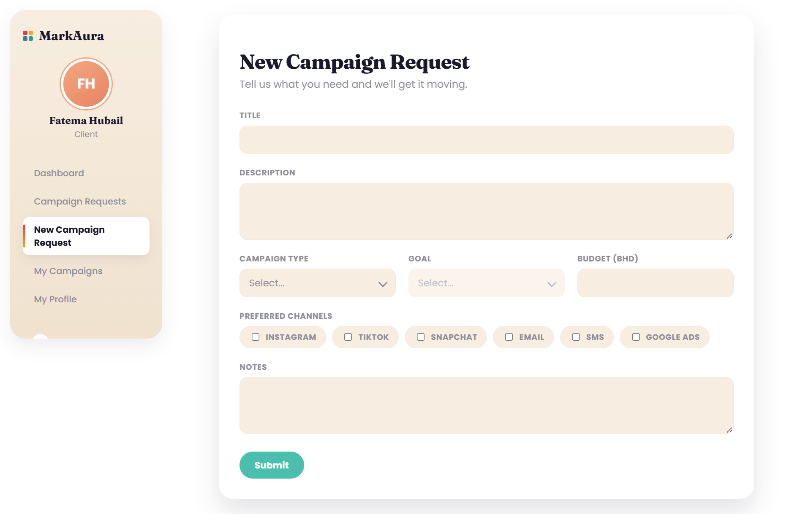 
  New campaign request form

**Tracking Requests**
- As a client, I want to see a list of all my submitted requests and their statuses, so that I know where each one stands without contacting the agency directly.
- As a client, I want to view the details of a specific request, so that I can review exactly what I submitted.

  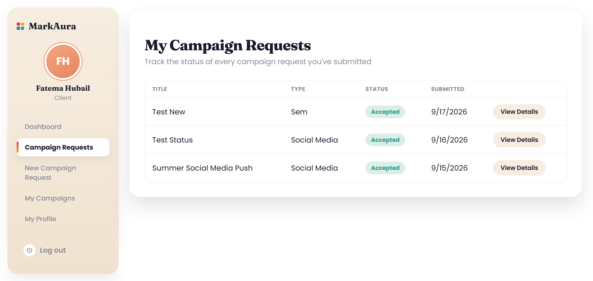 
  My Campaign Requests table

  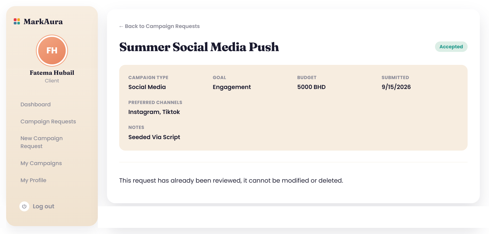 
  Campaign request detail page

**Tracking Campaigns**
- As a client, I want to view a list of my campaigns and their status (pending, in progress, or completed), so that I can stay informed on progress without needing a status meeting.
- As a client, I want to view the details of a specific campaign, including its budget, timeline, and preferred channels, so that I have the full picture in one place.
- As a client, I want to see the tasks currently being worked on for my campaign, so that I know what's actively being done.

   
  My Campaigns table

   
  Campaign detail page with tasks

**Boundaries**
- As a client, I want my data isolated from other clients, so that I never see requests or campaigns that aren't mine.
- As a client, I should not be able to change a request's or campaign's status myself, so that only agency staff can validate and move work through the pipeline.

### Agency staff
1. As an agency staff member, I want to view the dasboard so I can see current activities.

2. As an agency staff member, I want to review client campaign requests so I can decided how to handle them. 

3. As an agency staff member, I want to accept or reject campaign requests so I can manage incoming work.

4. As an agency staff member, I want to manage campaigns so I can track their progress.

5. As an agency staff member, I want to create and assign tasks so work is organized

6. As an agency staff member, I want to view assigned tasks so I can track the work that needs to be completed.

7. As an agency staff member, I want to update task status so I can keep the team informed about progress.

8. As an agency staff member, I want to manage outsource requests so I can coordinate work with external partners.

9. As an agency staff member, I want to view reports so I can monitor campaign performance.

10. As an agency staff member, I want to view my profile so I can manage my account information.

### Admin
1. As an admin, I want to sign in securely, so that I can manage the platform's staff and outsource accounts.
2. As an admin, I want to create a staff account with a specialty, so that they can be assigned campaign work in their area of expertise.
3. As an admin, I want to create an outsource agency account with its service types, so that staff can delegate matching work to them.
4. As an admin, I want to view a list of all staff and outsource accounts, so that I have a full picture of who's on the platform.
5. As an admin, I want to view a single user's account and profile details, so that I can check or troubleshoot their information.
6. As an admin, I want to edit a staff or outsource account's details (including specialty or service types), so that I can correct or update their information as roles change.
7. As an admin, I want to delete a staff or outsource account, so that I can remove access once someone is no longer with the agency or partner.

### Outsource partners

**Account & Profile**
- As an outsource partner, I want to sign in securely, so that I can access my assigned work and manage my agency profile.
- As an outsource partner, I want to view and update my company profile and service types, so that agency staff know what I can deliver and whether I’m currently available.
- As an outsource partner, I want to update my availability status, so I can indicate when I’m open for new work.

**Managing Assigned Tasks**
- As an outsource partner, I want to see all tasks assigned to my agency, so that I can plan workload and deadlines.
- As an outsource partner, I want to view task details, including campaign context, service type, due date, and payment, so that I understand the scope of the work.
- As an outsource partner, I want to accept or reject a task, so that I can confirm whether I can complete it.
- As an outsource partner, I want to update task progress and add notes, so that agency staff stay informed as work moves forward.
- As an outsource partner, I want to see whether a task is pending, accepted, in progress, delivered, completed, or rejected, so that I can track the full lifecycle of each assignment.

  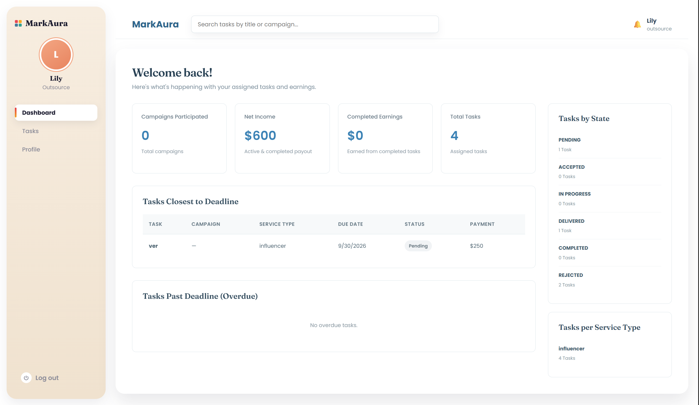 
  Outsource dashboard overview

  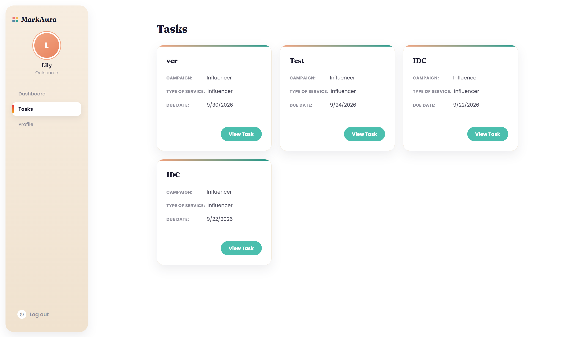 
  Assigned tasks list

  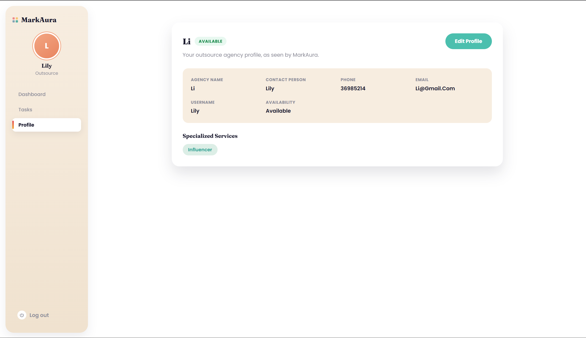 
  Outsource profile and service availability

  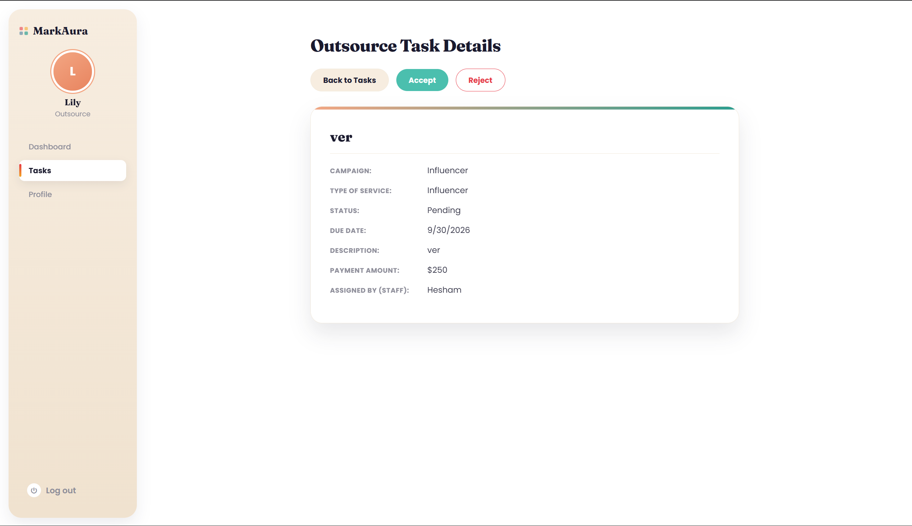 
  Outsource task details page

  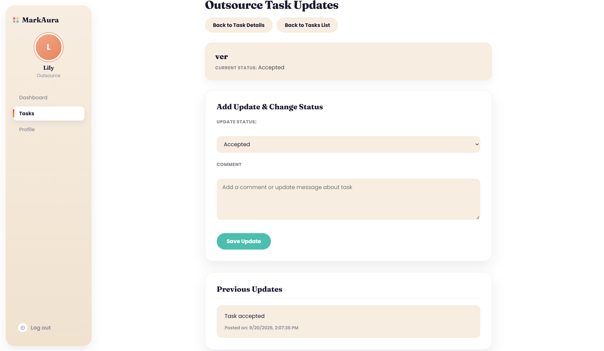 
  Outsource task update page

  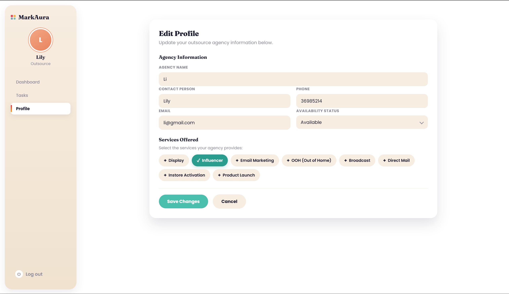 
  Outsource Edit account page

## Wireframes

Check out the wireframes sketching out layout and flow of the app covering the screens for clients, agency staff, and outsource partners across the request → campaign → task lifecycle.

### Client WireFrames

[Open Client wireframes in Excalidraw](https://excalidraw.com/#json=KVGBpR8L5VHBhtwp1NIRh,dwFCxrO4mXFGhTGH8-csUg) 

### Admin WireFrames

[Open Admin wireframes in Excalidraw](https://excalidraw.com/#json=SvL2zNvDnvWWTRajoaFbH,xYZN4i9fEsJA0UWlOk3d0w) 

### Agent Staff WireFrames

[Open Client wireframes in Excalidraw](https://excalidraw.com/#json=qT5Sfgg_m7Rd2KMgV_1AX,Vmgu_loLw0MozkdcNjXsGQ
)

### Outsource Partners Wireframes

## Technologies Used

**Client (this repo)**
- React 19
- React Router 8
- Vite
- ESLint
- Plain CSS (custom design system — no CSS framework)

**API**
- Node.js
- Express 5
- MongoDB with Mongoose
- JSON Web Tokens (`jsonwebtoken`) for authentication
- `bcrypt` for password hashing

**Tooling & Deployment**
- Git & GitHub (feature branches + pull requests)
- Vercel (client hosting)
- Render (API hosting)
- MongoDB Atlas (database hosting)

## ERD
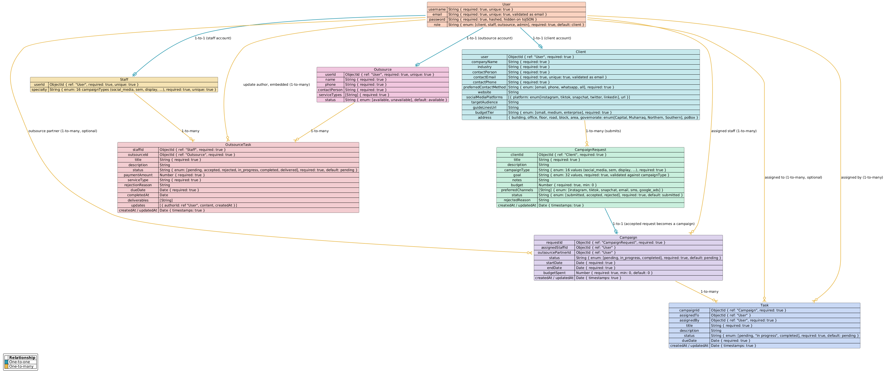

## Routing Tables

### Auth routes
 
| Path | Component | Access | Notes |
|---|---|---|---|
| `/register` | `ClientSignUpForm` | public | Client sign-up (account + company info) |
| `/sign-in` | `SignInForm` | public | Sign in |

### Client routes
 
| Path | Component | Access | Notes |
|---|---|---|---|
| `/` | `ClientDashboard` | client | Stat cards, requests/campaigns overview, recent activity |
| `/requests` | `MyCampaignRequests` | client | Table of all submitted requests and their statuses |
| `/requests/new` | `NewCampaignRequest` | client | Submit a new campaign request |
| `/requests/:id` | `CampaignRequestDetails` | client (owner) | View a request's details; update/delete while still `submitted` |
| `/requests/:id/edit` | `UpdateCampaignRequest` | client (owner, `submitted` only) | Edit a pending request |
| `/campaigns` | `MyCampaignsPage` | client | Table of campaigns and their status (pending/in progress/completed) |
| `/campaigns/:id` | `CampaignDetails` | client (owner) | Campaign details, including the tasks assigned to it |
| `/profile` | `ClientProfilePage` | client | View/edit company profile |
| `*` | `NotFoundPage` | public | Catch-all |

### Admin routes

| Path | Component | Access | Notes |
|---|---|---|---|
| `/admin/users` | `AdminUserManagement` | admin | Create/view/edit/delete staff and outsource accounts; admins land here directly after signing in |

### Agency staff routes

| Path | Component | Notes |
|---|---|---|
| `/dashboard` | `AgencyDashboard` | View agency activities and overview |
| `/campaign-requests` | `CampaignRequests` | View and manage client campaign requests |
| `/campaign-requests/:id` | `CampaignRequestDetails` | View request details and accept or reject |
| `/campaigns` | `Campaigns` | View and manage campaigns |
| `/campaigns/:id` | `CampaignDetails` | View campaign details and progress |
| `/tasks` | `Tasks` | View and manage agency tasks |
| `/tasks/:id` | `TaskDetails` | View and update task details |
| `/tasks/create` | `CreateTask` | Create and assign a task |
| `/outsource-requests` | `OutsourceRequests` | View and manage outsource requests |
| `/outsource-requests/:id` | `OutsourceRequestDetails` | View outsource request details |
| `/reports` | `Reports` | View campaign and task reports |
| `/profile` | `Profile` | View and manage agency staff profile |

### Outsource partners routes

| Path | Component | Access | Notes |
|---|---|---|---|
| `/outsource-dashboard` | `OutsourceDashboard` | outsource | Dashboard with task overview, search, earnings, and deadlines |
| `/profile` | `OutsourceProfile` | outsource | View/edit agency profile and service availability |
| `/outsource/profile` | `OutsourceProfile` | outsource | Alternate route for outsource profile |
| `/outsource-tasks` | `OutsourceAllTasks` | outsource | View all assigned tasks |
| `/outsource/tasks` | `OutsourceAllTasks` | outsource | Alias route for task list |
| `/outsource-tasks/:taskId` | `OutsourceTasksView` | outsource | View task details, accept or reject work |
| `/outsource-tasks/:taskId/updates` | `OutsourceTaskUpdates` | outsource | Add and review task updates |

## Component hierarchy
### Client Components

  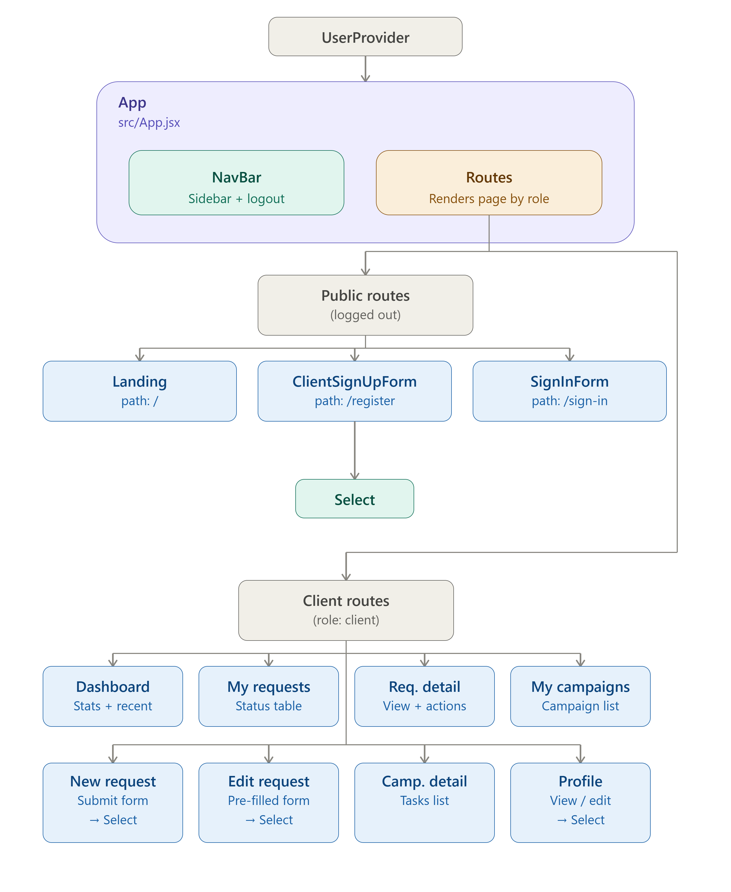

### Agency Components
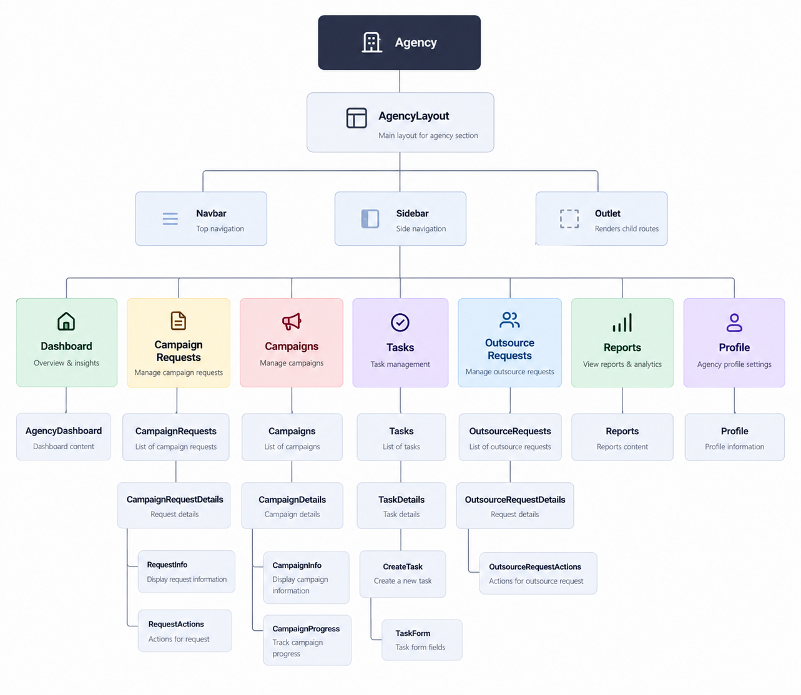

### OutSource Components

## Future Features

- A client-facing campaign review/approval step (approve, request changes, leave feedback) before a campaign goes live
- Staff departments with a manager to assign tasks to staff/outsource
- In-app notifications when a request is accepted/rejected, a task is assigned, or a campaign is completed
- File/asset uploads on campaign requests and tasks (briefs, deliverables)
- Search and filtering across requests, campaigns, and tasks on the staff dashboard
- Payment and payout tracking for outsourced work, including due amounts, completed payouts, and outstanding invoices
- A formal task lifecycle and QA review flow, where outsourced work can move from accepted to in progress to delivered and then be reviewed before final completion
- Partner performance analytics to track completion rates, turnaround times, rejection trends, and overall contribution across campaigns

## Attributions

Built during General Assembly's Software Engineering bootcamp

