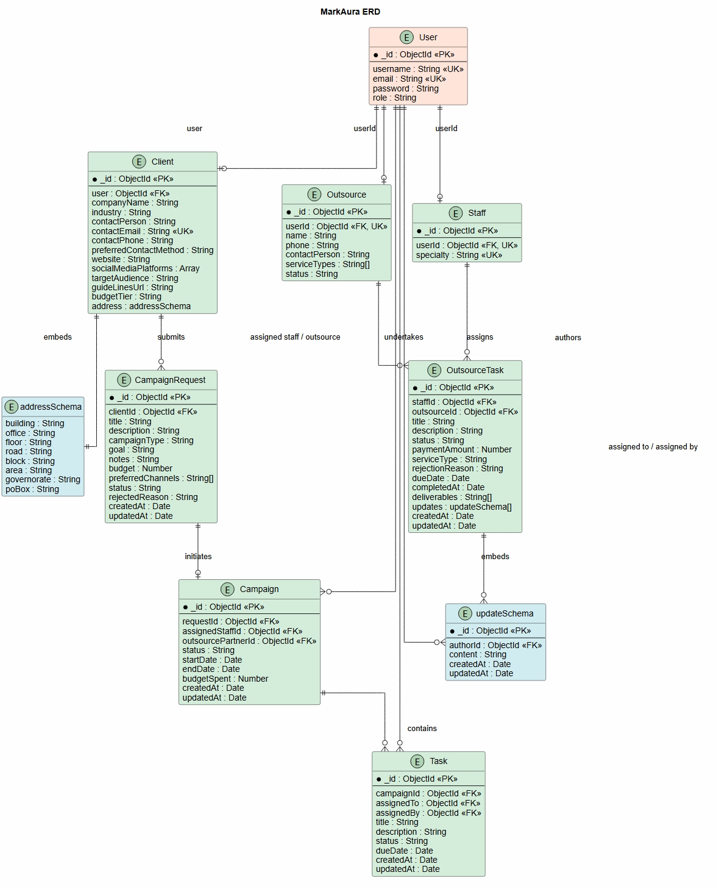
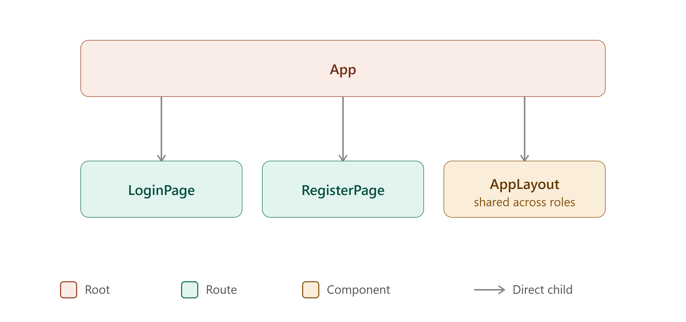
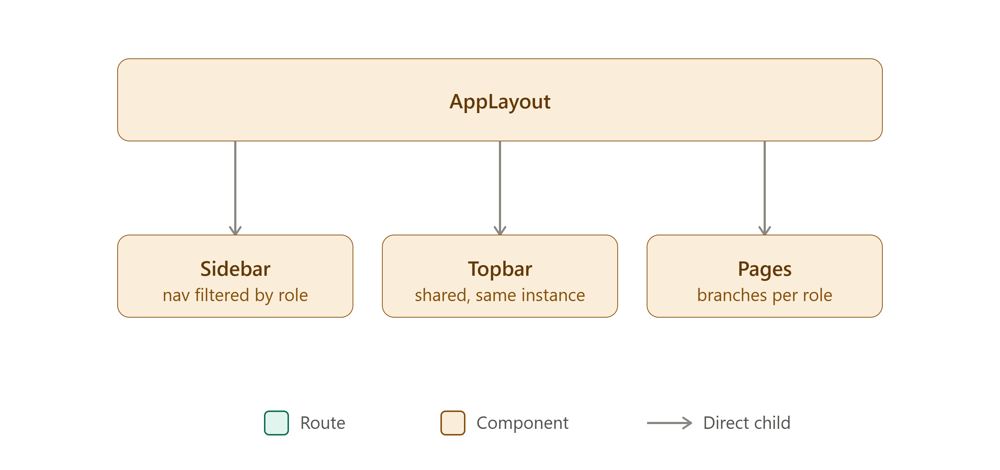
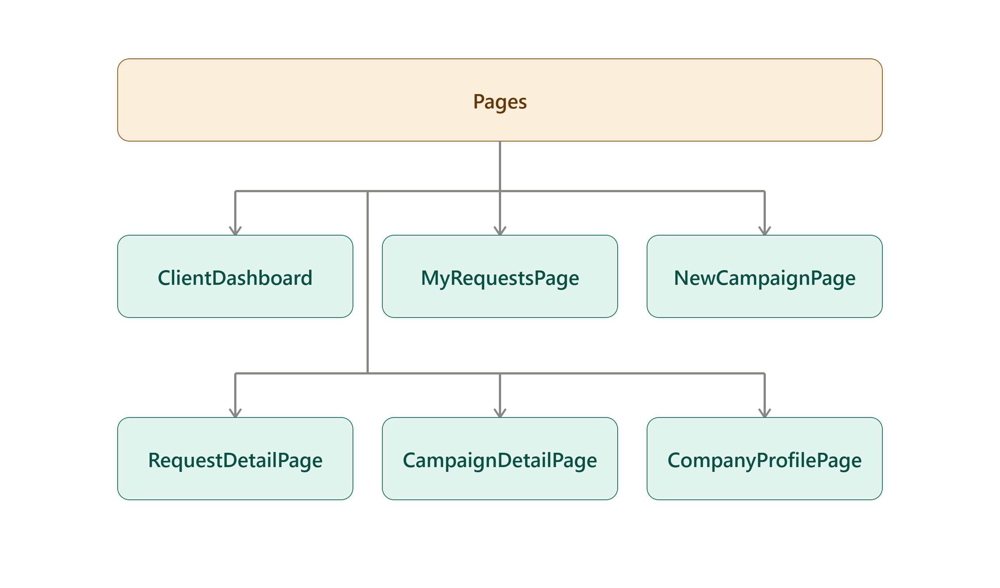

# MarkAura - Client Web App (React)

## Project idea & description

MarkOra is a marketing agency management platform that manages the full lifecycle of a campaign from a client's initial request, through planning and execution by agency staff, to coordination with outsourced partners. Instead of managing this back-and-forth over emails and spreadsheets, MarkOra gives each party (clients, agency staff, and outsource partners) a role-based view of exactly what they need to act on next: clients submit and track campaign requests, staff review requests and manage active campaigns, and outsource agencies handle delegated tasks all through a single, status-driven workflow.

This repository contains the **React frontend** for MarkAura.

## ScreenShot of MarkAura

## User Stories

### Client
**Account & Profile**
- As a client, I want to register and log in to the platform, so that I can access my company's campaign data securely.
- As a client, I want to view and update my company profile, so that my contact and industry information stays accurate.

**Submitting Campaign Requests**
- As a client, I want to submit a new campaign request with my goals, budget, and preferred channels, so that the agency has everything it needs to start planning.
- As a client, I want to edit my request while it's still awaiting review, so that I can correct or refine details before staff starts working on it.
- As a client, I want to cancel a request I submitted, so that I'm not committed to a campaign I no longer need if it hasn't been accepted yet.

**Tracking Requests**
- As a client, I want to see a list of all my submitted requests and their statuses, so that I know where each one stands without contacting the agency directly.
- As a client, I want to view the details of a specific request, including which staff member it's assigned to, so that I know who's handling my account.
**Tracking Active Campaigns**
- As a client, I want to view the progress of my active campaigns, so that I can stay informed on timeline and budget without needing a status meeting.
- As a client, I want to see whether an outsource agency has been brought onto my campaign, so that I understand who's contributing to the work, even if I don't see their internal tasks.

**Reviewing & Feedback**
- As a client, I want to review campaign deliverables when they reach the review stage, so that I can confirm they match what I approved.
- As a client, I want to leave comments or request changes on a campaign draft, so that the agency can revise it before it goes live.
- As a client, I want to give final approval on a campaign, so that it can move forward to launch only once I'm satisfied.

**Boundaries**
- As a client, I want my data isolated from other clients, so that I never see requests or campaigns that aren't mine.
- As a client, I should not be able to change a request's status myself, so that only agency staff can validate and accept work into the pipeline.
### Agency staff
1. As an agency staff member, I want to view the dasboard so I can see current activities.

2. As an agency staff member, I want to review client campaign requests so I can decided how to handle them. 

3. As an agency staff member, I want to accept or reject campaign requests so I can manage incoming work.

4. As an agency staff member, I want to manage campaigns so I can track their progress.

5. As an agency staff member, I want to create and assign tasks so work is organized

6. As an agency staff member, I want to view assigned tasks so I can track the work that needs to be completed.

7. As an agency staff member, I want to update task status so I can keep the team informed about progress.

8. As an agency staff member, I want to manage outsource requests so I can coordinate work with external partners.

9. As an agency staff member, I want to view reports so I can monitor campaign performance.

10. As an agency staff member, I want to view my profile so I can manage my account information.

### Outsource partners

## Wireframes

Check out the wireframes sketching out layout and flow of the app covering the screens for clients, agency staff, and outsource partners across the request → campaign → task lifecycle.

### Client WireFrames

[Open Client wireframes in Excalidraw](https://excalidraw.com/#json=HtugvHFQrEdtZtdNZ0Pr-,EjUBjAKtMfTTcD_qsOLgjA)

### Agent Staff WireFrames

[Open Client wireframes in Excalidraw](https://excalidraw.com/#json=qT5Sfgg_m7Rd2KMgV_1AX,Vmgu_loLw0MozkdcNjXsGQ
)

### Outsource Partners Wireframes

## Routing Tables

## ERD

### Auth routes
 
| Path | Component | Access | Notes |
|---|---|---|---|
| `/login` | `LoginPage` | public | |
| `/register` | `RegisterPage` | public |  |
 
### Client routes
 
| Path | Component | Access | Notes |
|---|---|---|---|
| `/dashboard` | `ClientDashboard` | client (protected) | stat cards, campaign list, activity feed |
| `/requests` | `MyRequestsPage` | client (protected) | full request table with filters |
| `/requests/new` | `NewRequestPage` | client (protected) | campaign type → goal form |
| `/requests/:id` | `RequestDetailPage` | client (protected, owner-only) | view a single request's status/history |
| `/campaigns` | `MyCampaignsPage` | client (protected) | list of accepted/active campaigns |
| `/campaigns/:id` | `CampaignDetailPage` | client (protected, owner-only) | stepper, budget, review/approve area |
| `/profile` | `CompanyProfilePage` | client (protected) | view/edit Client model fields |
| `*` | `NotFoundPage` | public | catch-all |

### Agency staff routes

| Path | Component | Notes |
|---|---|---|
| `/dashboard` | `AgencyDashboard` | View agency activities and overview |
| `/campaign-requests` | `CampaignRequests` | View and manage client campaign requests |
| `/campaign-requests/:id` | `CampaignRequestDetails` | View request details and accept or reject |
| `/campaigns` | `Campaigns` | View and manage campaigns |
| `/campaigns/:id` | `CampaignDetails` | View campaign details and progress |
| `/tasks` | `Tasks` | View and manage agency tasks |
| `/tasks/:id` | `TaskDetails` | View and update task details |
| `/tasks/create` | `CreateTask` | Create and assign a task |
| `/outsource-requests` | `OutsourceRequests` | View and manage outsource requests |
| `/outsource-requests/:id` | `OutsourceRequestDetails` | View outsource request details |
| `/reports` | `Reports` | View campaign and task reports |
| `/profile` | `Profile` | View and manage agency staff profile |

### Outsource partners routes

## Component hierarchy
### Client Components
**Top level**

  

**AppLayout**

  

**Pages**

  

### Agency Components

### OutSource Components

